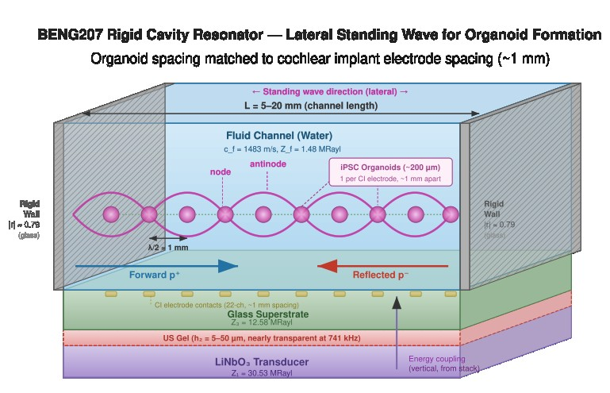

<pre>
Title: BENG207_Rigid_Cavity_Resonator_Model
Author: BENG207 students (Instructor: Akihiro J. Matsuoka, M.D., D.M.Sc., Ph.D., FACS, Co-instructor: James Friend, Ph.D.)
Course: BENG207 Winter/Spring Semester (2026)
Status: Draft
Type: Analytical model
License: Public domain
Further discussion: TBD
</pre>

Instruction to BENG207 students: Please review all of the variables/parameters.

---

## Table of Contents

* [Abstract](#abstract)
* [Background and Significance](#background-and-significance)
* [Deliverable](#deliverable)
* [BENG207 Rigid Cavity Resonator Model](#beng207-rigid-cavity-resonator-model-analytical-model)
* [Parameters](#parameters)
* [Output Figures: Captions](#output-figures-captions)

---

## Abstract

TBW

## Background and Significance

### From Vertical Transmission to Lateral Trapping

The BENG207_1 acoustic transfer-matrix model established the frequency-dependent transmission coefficient T(ω) through the vertical multilayer stack (LiNbO₃ – couplant – glass – water) and characterized how couplant degradation affects acoustic coupling efficiency. That model describes how energy enters the fluid channel from below. However, the functional acoustic field that performs the biological work — trapping single-suspended iPSCs and assembling them into 3D spheroids and organoids — propagates **laterally**, parallel to the glass surface, not vertically through the stack (I originally completely got this wrong, so if there is any inconsntency, let me know. I tried to fix everything though).

In our third-generation biohybrid cochlear implant design, SAWs generated by the LiNbO₃ transducer couple into the fluid channel and establish a lateral standing wave between the rigid sidewalls of the microchannel. The vertical stack (LiNbO₃ → US gel couplant → glass) serves as the energy delivery pathway, while the lateral standing wave between the channel sidewalls is the field that actually traps and organizes cells. The BENG207_1 model addresses the former; this model addresses the latter.

### Organoid Spacing Rationale: Matching Cochlear Implant Geometry

The human cochlea is approximately 30 mm in length, and a standard cochlear implant (CI) electrode array contains 22 channels (electrodes) distributed along this length. This gives an inter-electrode spacing of roughly 30/22 ≈ 1.36 mm. For the biohybrid CI to function, each organoid must interface with one CI electrode, meaning the organoid-to-organoid spacing must match the electrode-to-electrode spacing. We therefore target an organoid spacing of approximately **1 mm** (center-to-center), which is a conservative round number within the physiologically relevant range of 1–1.5 mm.

This spacing constraint directly determines the operating frequency. In a lateral standing wave, particles collect at pressure nodes spaced at $\lambda$/2. Setting $\lambda$/2 = 1 mm gives:

f = c_f / (2 × 1 mm) = 1483 / (2 × 0.001) ≈ **741 kHz**

This is consistent with the ~800 kHz operating frequency that Alexi has indicated for our experimental setup (Anna, you probably want to talk to Alexi to get this frequency consistent). At this frequency, the acoustic wavelength in water is $\lambda$ ≈ 2 mm, and a 1 mm spacing places one organoid per half-wavelength — each sitting in a pressure node with a trapping potential well roughly 1 mm wide, which comfortably accommodates a 200 µm diameter organoid with ~400 µm of clear space on each side for neurite extension toward neighboring organoids or spiral ganglion neurons.

### Channel Length and Organoid Count

The microchannel lengths under investigation range from 5 mm to 20 mm. At 1 mm node spacing, this accommodates:

* L = 5 mm → n = 5 nodes → 5 organoids
* L = 10 mm → n = 10 nodes → 10 organoids
* L = 15 mm → n = 15 nodes → 15 organoids
* L = 20 mm → n = 20 nodes → 20 organoids

These numbers align well with the 22-channel CI geometry. A 20 mm channel producing 20 organoids at 1 mm spacing would span two-thirds of the cochlear length — a realistic target for a first-generation biohybrid device. Shorter channels (5–10 mm) provide a practical test bed for validating the acoustic patterning before scaling to full cochlear length (In my opinion, shorter would yiled better results).

### The Rigid Cavity Resonator Concept

The channel sidewalls (glass or silicon, whichever you guys are using) have acoustic impedances far exceeding that of water. Borosilicate glass gives $Z_{3}$ = 12.58 MRayl versus Z_f = 1.48 MRayl in water, yielding a reflection coefficient:

$$
|r| = \frac{Z_3 - Z_f}{Z_3 + Z_f} \approx 0.79
$$

If silicon sidewalls are used (Z_Si ≈ 19.7 MRayl), then |r| ≈ 0.86. In either case, the reflection is strong enough to establish a well-defined standing wave. The channel therefore behaves as a **rigid cavity resonator** — an acoustic volume bounded on both lateral ends by high-impedance walls.

The resonant modes of the cavity occur at frequencies satisfying L = n $\lambda$/2, or equivalently:

$$
f_n = \frac{n\,c_f}{2L}
$$

where n = 1, 2, 3, ... is the mode number. Each mode produces n pressure nodes, evenly spaced at intervals of L/n. For organoid formation, we select the mode number n such that L/n ≈ 1 mm.

The key advantage of operating at low mode numbers (n = 5–20) compared to our earlier estimate (n = 25–100 at 200 µm spacing) is that the resonances are broader, the Q-factor is lower, frequency tolerance is more forgiving, and nodal uniformity across the channel is better. This makes the system substantially easier to drive and more robust to manufacturing variations.

### Quality Factor and Nodal Uniformity

The quality factor Q of the cavity determines how sharply each resonance peaks and how tolerant the system is to frequency detuning. For a cavity with wall reflection coefficient |r| and fluid attenuation α:

$$
Q \approx \frac{\pi n}{1 - |r|^2 + 2\alpha L}
$$

At mode numbers n = 5–20, Q is moderate (on the order of 10–50), meaning the resonances have a useful bandwidth of tens of kHz. This is experimentally favorable — the driving frequency does not need to be controlled to sub-kHz precision.

Nodal uniformity — whether all nodes across the channel length have the same pressure amplitude — is critical for producing organoids of uniform size. Two mechanisms degrade uniformity. First, fluid attenuation α causes the standing wave amplitude to decay from the excitation point toward the center of the cavity. At 741 kHz in water, α is very small (~0.0001 Np/m, scaling as f²), so attenuation is negligible even for 20 mm channels. Second, imperfect reflection (|r| < 1) means the reflected wave is weaker than the forward wave, creating an asymmetric pressure envelope. The standing wave ratio S = |r| · exp(−2αL) quantifies this asymmetry. For |r| = 0.79 (glass) and L = 20 mm at 741 kHz, S ≈ 0.79, giving a contrast ratio C = ((1+S)/(1−S))² ≈ 58 (17.6 dB). Using silicon sidewalls (|r| = 0.86) improves this to C ≈ 107 (20.3 dB).

At the lower operating frequency (~741 kHz vs. 20 MHz), the attenuation per unit length is roughly (0.741/20)² ≈ 1/730 times smaller than at 20 MHz. This means attenuation is essentially irrelevant for our channel lengths, and the dominant factor limiting standing wave quality is the wall reflection coefficient |r|.

### Relationship to the Transfer-Matrix Model

The rigid cavity resonator model and the BENG207_1 transfer-matrix model describe orthogonal aspects of the same device. The transfer-matrix model determines how efficiently the transducer drives acoustic energy through the vertical stack and into the fluid channel — this sets the absolute pressure amplitude p₀ available for lateral trapping. The cavity resonator model then determines how that energy is spatially organized laterally between the sidewalls — this sets the nodal pattern, contrast, and uniformity.

The two models are coupled through p₀: the acoustic pressure available for the lateral standing wave is the transmitted pressure from the vertical stack. If couplant degradation reduces T(ω) by 3 dB (as predicted by the transfer-matrix model under gel aging), the radiation force at every node drops by 50%, which may be insufficient to hold organoids against convective disturbances in the channel. Note that the transfer-matrix model parameters (particularly the couplant layer properties) should be re-evaluated at ~741 kHz rather than 20 MHz, as the frequency-dependent behavior of the Kelvin-Voigt couplant differs substantially at these two frequencies.

### Experimental Validation

The key predictions of the rigid cavity resonator model are directly testable:

* **Mode number verification:** The number of organoids formed in a channel of known length directly reveals the active mode number n and confirms the effective half-wavelength spacing. A 10 mm channel at 741 kHz should produce exactly 10 organoids at 1 mm spacing.
* **Nodal uniformity:** Imaging the size distribution of organoids along the channel reveals spatial variations in acoustic radiation force. Systematic size gradients (larger near walls, smaller at center, or vice versa) indicate standing wave amplitude non-uniformity.
* **Frequency sensitivity:** Sweeping the driving frequency through a resonance peak and measuring organoid formation quality (number, spacing regularity, size uniformity) maps the effective Q of the cavity.
* **Wall material dependence:** Comparing organoid quality between glass-walled and silicon-walled channels at the same frequency tests the predicted dependence on |r|.
* **Spacing verification:** The center-to-center distance between adjacent organoids should be λ/2 ≈ 1 mm. Deviations indicate either frequency error, non-uniform channel geometry, or temperature-dependent sound speed changes.

## Deliverable

Here we compute the lateral standing wave pressure field p(x) inside a rigid cavity resonator of length L = 5–20 mm, driven at frequencies near f = c_f/(2 × 1 mm) ≈ 741 kHz. We characterize:

1. The resonant mode structure (f_n, mode spacing, Q-factor) as a function of channel length and wall material.
2. The spatial pressure profile p(x) at resonance, including amplitude non-uniformity due to attenuation and imperfect reflection.
3. The acoustic radiation force at each node, and the predicted organoid count, spacing, and size uniformity.
4. Sensitivity to frequency detuning, wall reflectivity, and channel length tolerance.
5. The coupling layer sub-model (vertical stack transmission into the channel), evaluated at ~741 kHz.

## BENG207 Rigid Cavity Resonator Model (Analytical Model)

### Standing Wave in Lateral Cavity (Part A)

The forward and reflected pressure waves propagate laterally along the channel (x-axis, parallel to the glass surface):

$$
p(x) = p_0 e^{-(\alpha - i k)x} + r\,p_0 e^{-(\alpha - i k)(2L - x)}
$$

where α is the fluid attenuation coefficient (Np/m), k = 2πf/c_f is the wavenumber, L is the channel length (5–20 mm), and r is the complex reflection coefficient at the rigid sidewalls. The cavity resonance condition is:

$$
f_n = \frac{n\,c_f}{2L}, \quad n = 1,2,3,\ldots
$$

The standing wave ratio at position x is S(x) = |r| · exp(−2α(L − x)), and the contrast is C(x) = ((1 + S)/(1 − S))².

The acoustic radiation force on a compressible particle (iPSC) at position x is proportional to:

$$
F_{\mathrm{rad}}(x) \propto -\frac{\partial}{\partial x}\left[\langle p^2(x)\rangle\right]
$$

which drives particles toward pressure nodes. The force magnitude at each node determines the trapping strength and influences the final organoid compaction.

### Coupling Layer Sub-Model (Part B)

The vertical stack (transducer → couplant → glass) determines the pressure amplitude p₀ that enters the channel. This sub-model is carried forward from the echo chamber model, now evaluated at ~741 kHz:

$$
Z_{\mathrm{in}}(d) = Z_2 \,\frac{Z_3 + i Z_2 \tan(k_2 d)}{Z_2 + i Z_3 \tan(k_2 d)}
$$

$$
T_{\mathrm{power}} = 1 - |r_{\mathrm{vert}}|^2, \quad
r_{\mathrm{vert}} = \frac{Z_{\mathrm{in}} - Z_1}{Z_{\mathrm{in}} + Z_1}
$$

At 741 kHz, the couplant wavelength is λ₂ = c₂/f = 1500/741000 ≈ 2.02 mm, so typical couplant thicknesses (5–50 µm) are deep in the sub-wavelength regime (d/λ₂ < 0.025). This means the couplant is nearly transparent at this frequency, and coupling efficiency is much less sensitive to couplant thickness than at 20 MHz.

### Figure

Figure 1: Three-dimensional schematic of the rigid cavity resonator. The vertical stack (LiNbO₃ → US gel → glass) is shown at the bottom. The fluid channel sits on top of the glass, bounded laterally by rigid sidewalls. The standing wave (pink) propagates horizontally along the channel length, with pressure nodes spaced at λ/2 ≈ 1 mm. iPSC organoids (~200 µm diameter) form at each pressure node, matching the inter-electrode spacing of a 22-channel cochlear implant. Forward wave (p⁺) enters from the left wall; reflected wave (p⁻) returns from the right wall.

## Parameters

The parameters used in this model are as follows:

**Lateral cavity (standing wave direction):**

* Channel length: L = 5–20 mm
* Sidewall material: borosilicate glass (Z₃ = 12.58 MRayl) or silicon (Z_Si ≈ 19.7 MRayl)
* Fluid: water, ρ_f = 1000 kg/m³, c_f = 1483 m/s, Z_f = 1.48 MRayl
* Target node spacing: λ/2 ≈ 1 mm → f ≈ 741 kHz (~800 kHz per Alexi)
* Mode numbers: n = 5 (L = 5 mm) to n = 20 (L = 20 mm)
* Fluid attenuation at 741 kHz: α ≈ 0.0001 Np/m (negligible)
* Target organoid diameter: ~200 µm
* Inter-organoid spacing: ~1 mm (matching CI electrode spacing)

**Vertical stack (energy coupling):**

* LiNbO₃ transducer: ρ₁ = 4647 kg/m³, c₁ = 6570 m/s, Z₁ = 30.53 MRayl
* US gel couplant: ρ₂ = 1020 kg/m³, c₂ = 1500 m/s, Z₂ = 1.53 MRayl
* Borosilicate glass: ρ₃ = 2230 kg/m³, c₃ = 5640 m/s, Z₃ = 12.58 MRayl
* Couplant thickness: h₂ = 5–50 µm
* Couplant wavelength at 741 kHz: λ₂ ≈ 2.02 mm (h₂/λ₂ < 0.025)

## Output Figures: Captions

* **Fig 1** — Lateral pressure field |p(x)| across the channel for three channel lengths (5, 10, 20 mm) at their respective resonant modes (n = 5, 10, 20), showing node positions at ~1 mm spacing and the amplitude envelope from imperfect wall reflection

* **Fig 2** — Standing wave contrast map (2D heatmap) — contrast in dB at the channel midpoint as a function of channel length L (1–25 mm) and sidewall reflection coefficient |r| (0.5–0.99), with glass and silicon |r| values marked

* **Fig 3** — Resonant mode structure — mode frequencies f_n vs. channel length, with the target operating band (~741 kHz) highlighted, showing how mode spacing Δf = c_f/(2L) varies with L and the number of organoids per channel

* **Fig 4** — Nodal uniformity profile — acoustic radiation force magnitude at each node position along the channel, normalized to the strongest node, for glass vs. silicon sidewalls at L = 5, 10, and 20 mm

* **Fig 5** — Coupling layer characterization — input impedance Z_in and power transmission T through the vertical stack as a function of couplant thickness d at 741 kHz, demonstrating that the couplant is nearly transparent (d/λ₂ < 0.025) at this frequency

* **Fig 6** — Frequency sensitivity — organoid spacing error (deviation from 1 mm) and contrast loss as a function of frequency detuning Δf/f for different channel lengths, quantifying how precisely the driving frequency must be controlled

* **Fig 7** — Combined design space — number of organoids, minimum nodal force (weakest node), and Q-factor vs. channel length for glass and silicon sidewalls, providing a single-figure summary for channel design decisions
