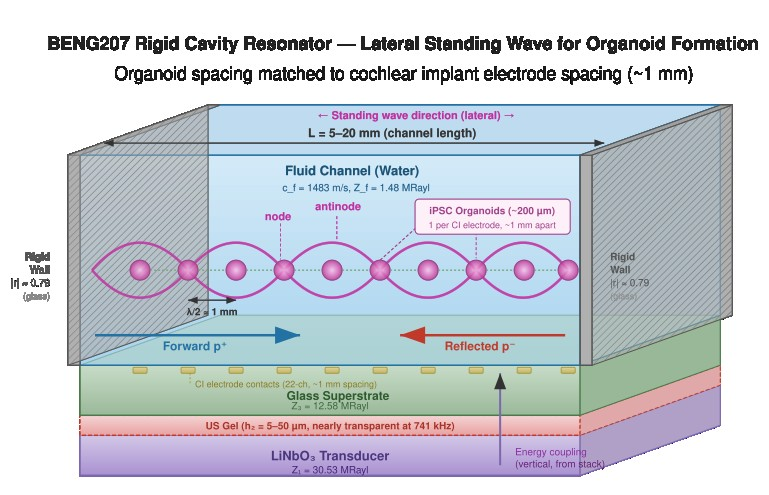

<pre>
Title: BENG207_Rigid_Cavity_Resonator_Model
Author: BENG207 students (Instructor: Akihiro J. Matsuoka, M.D., D.M.Sc., Ph.D., FACS, Co-instructor: James Friend, Ph.D.)
Course: BENG207 Winter/Spring Semester (2026)
Status: Draft
Type: Analytical model
License: Public domain
Further discussion: TBD
</pre>

Instruction to BENG207 students: Please review all of the variables/parameters!!!

---

## Table of Contents

* [Abstract](#abstract)
* [Background and Significance](#background-and-significance)
* [Deliverable](#deliverable)
* [BENG207 Rigid Cavity Resonator Model](#beng207-rigid-cavity-resonator-model-analytical-model)
* [Parameters](#parameters)
* [Output Figures: Captions](#output-figures-captions)
* [Part C: Dual-Transducer Configuration](#part-c-dual-transducer-configuration)
* [Part D: PDMS Wall Transmission](#part-d-pdms-wall-transmission)
* [Part E: Glass Slide Vertical Confinement](#part-e-glass-slide-vertical-confinement)
* [References](#references)

## Documentation

- [Student GitHub Workflow](GitHub_Upload_Instruction_BENG207.md)

- [More about Gor'kov contrast factor](BENG207_2_Gorkov_Explanation.md)

- [Final words on Gor'kov contrast factor](BENG207_2_Gorkov_Explanation_2.md)

## 

## Abstract

TBW

## Background and Significance

### From Vertical Transmission to Lateral Trapping

The BENG207_1 acoustic transfer-matrix model established the frequency-dependent transmission coefficient T(ω) through the vertical multilayer stack (lithium niobate, LiNbO₃ – couplant – glass – water) and characterized how couplant degradation affects acoustic coupling efficiency. That model describes how energy enters the fluid channel from below. However, the functional acoustic field that performs the biological work — trapping single-suspended induced pluripotent stem cells (iPSCs) and assembling them into 3D spheroids and organoids — propagates **laterally**, parallel to the glass surface, not vertically through the stack (I originally completely got this wrong, so if there is any inconsntency, let me know. I tried to fix everything though).

In our third-generation biohybrid cochlear implant design, surface acoustic waves (SAWs) generated by the LiNbO₃ transducer couple into the fluid channel and establish a lateral standing wave between the rigid sidewalls of the microchannel. The vertical stack (LiNbO₃ → ultrasound (US) gel couplant → glass) serves as the energy delivery pathway, while the lateral standing wave between the channel sidewalls is the field that actually traps and organizes cells. The BENG207_1 model addresses the former; this model addresses the latter.

### Organoid Spacing Rationale: Matching Cochlear Implant Geometry

The human cochlea is approximately 30 mm in length, and a standard cochlear implant (CI) electrode array contains 22 channels (electrodes) distributed along this length. This gives an inter-electrode spacing of roughly 30/22 ≈ 1.36 mm. For the biohybrid CI to function, each organoid must interface with one CI electrode, meaning the organoid-to-organoid spacing must match the electrode-to-electrode spacing. We therefore target an organoid spacing of approximately **1 mm** (center-to-center), which is a conservative round number within the physiologically relevant range of 1–1.5 mm.

This spacing constraint directly determines the operating frequency. In a lateral standing wave, particles collect at pressure nodes spaced at $\lambda$/2. Setting $\lambda$/2 = 1 mm gives:

f = c_f / (2 × 1 mm) = 1483 / (2 × 0.001) ≈ **741 kHz**

This is consistent with the ~800 kHz operating frequency that Alexi has indicated for our experimental setup (Anna, you probably want to talk to Alexi to get this frequency consistent). At this frequency, the acoustic wavelength in water is $\lambda$ ≈ 2 mm, and a 1 mm spacing places one organoid per half-wavelength — each sitting in a pressure node with a trapping potential well roughly 1 mm wide, which comfortably accommodates a 200 µm diameter organoid with ~400 µm of clear space on each side for neurite extension toward neighboring organoids or spiral ganglion neurons.

### Channel Length and Organoid Count

The microchannel lengths under investigation range from 5 mm to 20 mm. At 1 mm node spacing, this accommodates:

* L = 5 mm → n = 5 nodes → 5 organoids
* L = 10 mm → n = 10 nodes → 10 organoids
* L = 15 mm → n = 15 nodes → 15 organoids
* L = 20 mm → n = 20 nodes → 20 organoids

These numbers align well with the 22-channel CI geometry. A 20 mm channel producing 20 organoids at 1 mm spacing would span two-thirds of the cochlear length — a realistic target for a first-generation biohybrid device. Shorter channels (5–10 mm) provide a practical test bed for validating the acoustic patterning before scaling to full cochlear length (In my opinion, shorter would yiled better results).

### The Rigid Cavity Resonator Concept

The channel sidewalls (glass or silicon, whichever you guys are using) have acoustic impedances far exceeding that of water. Borosilicate glass gives $Z_{3}$ = 12.58 MRayl (megarayleigh, 10⁶ kg/m²s) versus Z_f = 1.48 MRayl in water, yielding a reflection coefficient magnitude |r| (the absolute value of the pressure reflection coefficient):

$$
|r| = \frac{Z_3 - Z_f}{Z_3 + Z_f} \approx 0.79
$$

If silicon sidewalls are used (Z_Si ≈ 19.7 MRayl), then |r| ≈ 0.86. In either case, the reflection is strong enough to establish a well-defined standing wave. The channel therefore behaves as a **rigid cavity resonator** — an acoustic volume bounded on both lateral ends by high-impedance walls.

The resonant modes of the cavity occur at frequencies satisfying L = n $\lambda$/2, or equivalently:

$$
f_n = \frac{n\,c_f}{2L}
$$

where n = 1, 2, 3, ... is the mode number. Each mode produces n pressure nodes, evenly spaced at intervals of L/n. For organoid formation, we select the mode number n such that L/n ≈ 1 mm.

The key advantage of operating at low mode numbers (n = 5–20) compared to our earlier estimate (n = 25–100 at 200 µm spacing) is that the resonances are broader, the Q-factor is lower, frequency tolerance is more forgiving, and nodal uniformity across the channel is better. This makes the system substantially easier to drive and more robust to manufacturing variations.

### Quality Factor and Nodal Uniformity

The quality factor Q of the cavity determines how sharply each resonance peaks and how tolerant the system is to frequency detuning. For a cavity with wall reflection coefficient |r| and fluid attenuation α:

$$
Q \approx \frac{\pi n}{1 - |r|^2 + 2\alpha L}
$$

At mode numbers n = 5–20, Q is moderate (on the order of 10–50), meaning the resonances have a useful bandwidth of tens of kHz. This is experimentally favorable — the driving frequency does not need to be controlled to sub-kHz precision.

Nodal uniformity — whether all nodes across the channel length have the same pressure amplitude — is critical for producing organoids of uniform size. Two mechanisms degrade uniformity. First, fluid attenuation α causes the standing wave amplitude to decay from the excitation point toward the center of the cavity. At 741 kHz in water, α is very small (~0.0001 Np/m (nepers per meter), scaling as f²), so attenuation is negligible even for 20 mm channels. Second, imperfect reflection (|r| < 1) means the reflected wave is weaker than the forward wave, creating an asymmetric pressure envelope. The standing wave ratio S = |r| · exp(−2αL) quantifies this asymmetry. For |r| = 0.79 (glass) and L = 20 mm at 741 kHz, S ≈ 0.79, giving a contrast ratio C = ((1+S)/(1−S))² ≈ 58 (17.6 dB, decibels). Using silicon sidewalls (|r| = 0.86) improves this to C ≈ 107 (20.3 dB).

At the lower operating frequency (~741 kHz vs. 20 MHz), the attenuation per unit length is roughly (0.741/20)² ≈ 1/730 times smaller than at 20 MHz. This means attenuation is essentially irrelevant for our channel lengths, and the dominant factor limiting standing wave quality is the wall reflection coefficient |r|.

### Relationship to the Transfer-Matrix Model (AKA BENG207_Multilayer Model)

The rigid cavity resonator model and the BENG207_1 transfer-matrix model describe orthogonal aspects of the same device. The transfer-matrix model determines how efficiently the transducer drives acoustic energy through the vertical stack and into the fluid channel — this sets the absolute pressure amplitude p₀ available for lateral trapping. The cavity resonator model then determines how that energy is spatially organized laterally between the sidewalls — this sets the nodal pattern, contrast, and uniformity.

The two models are coupled through p₀: the acoustic pressure available for the lateral standing wave is the transmitted pressure from the vertical stack. If couplant degradation reduces T(ω) by 3 dB (as predicted by the transfer-matrix model under gel aging), the radiation force at every node drops by 50%, which may be insufficient to hold organoids against convective disturbances in the channel. Note that the transfer-matrix model parameters (particularly the couplant layer properties) should be re-evaluated at ~741 kHz rather than 20 MHz, as the frequency-dependent behavior of the Kelvin-Voigt couplant differs substantially at these two frequencies.

### Experimental Validation

The key predictions of the rigid cavity resonator model are directly testable:

* **Mode number verification:** The number of organoids formed in a channel of known length directly reveals the active mode number n and confirms the effective half-wavelength spacing. A 10 mm channel at 741 kHz should produce exactly 10 organoids at 1 mm spacing.
* **Nodal uniformity:** Imaging the size distribution of organoids along the channel reveals spatial variations in acoustic radiation force. Systematic size gradients (larger near walls, smaller at center, or vice versa) indicate standing wave amplitude non-uniformity.
* **Frequency sensitivity:** Sweeping the driving frequency through a resonance peak and measuring organoid formation quality (number, spacing regularity, size uniformity) maps the effective Q of the cavity.
* **Wall material dependence:** Comparing organoid quality between glass-walled and silicon-walled channels at the same frequency tests the predicted dependence on |r|.
* **Spacing verification:** The center-to-center distance between adjacent organoids should be λ/2 ≈ 1 mm. Deviations indicate either frequency error, non-uniform channel geometry, or temperature-dependent sound speed changes.

### Gor'kov Acoustic Radiation Force: From Pressure Gradient to Physical Force

The original version of this model computed radiation force as proportional to −∂/∂x⟨p²⟩, which is dimensionless (or rather, in units of Pa²/m when the pressure field is normalized to p₀ = 1 Pa). This is sufficient for predicting *where* organoids form (pressure nodes) and comparing *relative* force between nodes (uniformity), but it does not tell you *how hard* the acoustic field is actually pulling on a cell and therefore somewhat unrelistic in nature. 

To get force in physical units (Newtons), we need the Gor'kov potential formalism. IF you want to read upon it, please see For a small compressible sphere of radius $a$ in a standing wave, the time-averaged radiation force is:

$$
F_{\mathrm{rad}} = -\nabla U = \Phi \cdot \frac{\pi a^3}{3 \rho_f c_f^2} \cdot \left(-\frac{\partial}{\partial x}\langle p^2 \rangle\right)
$$

where $\Phi$ is the **acoustic contrast factor**:

$$
\Phi = \frac{f_1}{3} + \frac{f_2}{2}
$$

with monopole and dipole scattering coefficients:

$$
f_1 = 1 - \frac{\kappa_p}{\kappa_f} = 1 - \frac{\rho_f c_f^2}{\rho_p c_p^2}, \qquad
f_2 = \frac{2(\rho_p - \rho_f)}{2\rho_p + \rho_f}
$$

Here $\kappa_p$ and $\kappa_f$ are the compressibilities of the particle and fluid, respectively; $\rho_p$ and $c_p$ are the density and sound speed of the particle (cell/organoid).

The sign of $\Phi$ determines the trapping behavior:

* **$\Phi$ > 0:** particles migrate to pressure **nodes** (our case — this is what we want)
* **$\Phi$ < 0:** particles migrate to pressure **antinodes** (e.g., lipid droplets, gas bubbles)

#### Beads vs. Cells: Why the Literature Value of Φ ≈ 0.17 Is Wrong for Our System (EXTREMELY IMPORTANT!!!!)

Much of the acoustofluidics literature reports $\Phi$ ≈ 0.17, which comes from polystyrene beads (ρ_p = 1050 kg/m³, c_p = 2350 m/s) — the standard calibration particle for acoustic trapping experiments. This is the value you will find in most review papers and textbook examples. **However, this value does not apply to cells or organoids.**

The critical difference is the sound speed. Polystyrene has c_p = 2350 m/s, which is far above water (c_f = 1483 m/s). This gives a large monopole coefficient f₁ ≈ 0.44 because the compressibility ratio κ_p/κ_f is small — polystyrene is much stiffer than water. Cells, on the other hand, are mostly water with some protein content, giving c_p ≈ 1520–1600 m/s — only slightly above water. This makes f₁ much smaller.

For our iPSC organoids, using representative cell properties (ρ_p ≈ 1050 kg/m³, c_p ≈ 1550 m/s, consistent with Cohen et al., 2020):

* f₁ = 1 − (1000 × 1483²) / (1050 × 1550²) ≈ **0.128** (monopole — compressibility contrast)
* f₂ = 2 × (1050 − 1000) / (2 × 1050 + 1000) ≈ **0.032** (dipole — density contrast)
* **Φ = 0.128/3 + 0.032/2 ≈ 0.059**

Compare with polystyrene beads:

* f₁ = 1 − (1000 × 1483²) / (1050 × 2350²) ≈ 0.62
* f₂ = 0.032 (same density)
* Φ ≈ 0.62/3 + 0.032/2 ≈ 0.22

So **cells have roughly 3× lower acoustic contrast factor than polystyrene beads**. The practical consequence is that the acoustic pressure amplitude p₀ required to trap cells is √3 ≈ 1.7× higher than for beads (since force scales as p₀²), or equivalently the acoustic power must be ~3× higher. This is an important design consideration: demonstrations with beads at low power may not replicate with cells unless the power is increased.

Note that the density contrast (f₂ ≈ 0.032) is the same for both beads and cells since they have similar densities. The entire difference in Φ comes from the monopole (compressibility) term f₁. This means the dominant physical mechanism trapping polystyrene beads is their stiffness relative to water, whereas for cells, the trapping is weaker and comes from a more balanced combination of the (small) stiffness and density contrasts.

Cohen et al. (2020) experimentally confirmed that dorsal root ganglion (DRG) neurons and PC12 cells are successfully trapped at acoustic pressure nodes using bulk acoustic wave (BAW) excitation at 1.14 MHz — the same frequency range as our system (~741 kHz). Their success demonstrates that the lower Φ for biological cells is still sufficient for stable trapping, provided adequate acoustic pressure is supplied.

The Gor'kov force in the model output (Fig 4) is reported in Newtons assuming p₀ = 1 Pa normalization. To estimate the actual force on a 200 µm diameter organoid at a realistic acoustic pressure (e.g., p₀ = 100 kPa), multiply the reported values by p₀² = 10¹⁰. This gives forces on the order of femtonewtons to piconewtons per organoid, which is consistent with the trapping forces reported in the acoustofluidics literature.

**BENG207 Students: the values ρ_p = 1050 kg/m³ and c_p = 1550 m/s are reasonable defaults but should be updated if direct measurements of organoid acoustic properties become available. The contrast factor is sensitive to c_p — a 5% change in c_p changes Φ by ~20%.**

### Supporting Literature

Two recent papers directly validate the physics of our model at the relevant frequency range (Thanks to Alexi!):

**Wang et al. (2022, Applied Physics Letters)** demonstrated standing wave patterning in a glass cuvette (rigid cavity) at 489 kHz and 734 kHz using a single 500 kHz broadband transducer. Their 10 mm cuvette at mode N = 9 produced node spacing of ~1.1 mm — nearly identical to our 1 mm target. Their resonant mode equation f_N = Nc_f/(2L) is the same as ours. This paper provides direct experimental validation that rigid-wall standing waves at our operating frequency produce well-defined node patterns with millimeter-scale spacing, and that a simple 1-D model accurately predicts node positions. Their sequential mode-switching technique (applying mode N = 6 first, then N = 9) could be relevant if selective node population is ever needed.

**Cohen et al. (2020, Scientific Reports)** used both SAWs and BAWs to pattern neurons (DRG neurons and PC12 cells) into organized clusters on a 3D collagen hydrogel, then demonstrated that neurons spontaneously grew neurites toward adjacent clusters over 2–6 days. Their BAW setup operated at 1.14 MHz (same order as our 741 kHz). This is directly relevant to the biological endpoint of our biohybrid CI: acoustically patterned neural aggregates forming directed inter-cluster connections. Their work confirms that (a) biological cells have sufficient acoustic contrast for stable trapping at sub-MHz to low-MHz frequencies despite Φ being lower than for polystyrene beads, and (b) acoustically positioned neurons produce directed neurite outgrowth governed by chemical cues from neighboring clusters — exactly the organoid-to-spiral ganglion neuron (SGN) connectivity our device requires.

## Deliverable

Here we compute the lateral standing wave pressure field p(x) inside a rigid cavity resonator of length L = 5–20 mm, driven at frequencies near f = c_f/(2 × 1 mm) ≈ 741 kHz. We characterize:

1. The resonant mode structure (f_n, mode spacing, Q-factor) as a function of channel length and wall material.
2. The spatial pressure profile p(x) at resonance, including amplitude non-uniformity due to attenuation and imperfect reflection.
3. The acoustic radiation force at each node, and the predicted organoid count, spacing, and size uniformity.
4. Sensitivity to frequency detuning, wall reflectivity, and channel length tolerance.
5. The coupling layer sub-model (vertical stack transmission into the channel), evaluated at ~741 kHz.
6. **(Part C)** Dual-transducer standing wave: pressure field, phase-controlled node positioning, amplitude imbalance tolerance, and nodal uniformity comparison with single-source.
7. **(Part D)** PDMS wall transmission: power transmission vs. wall thickness at 741 kHz, effective contrast through lossy PDMS, and attenuation sensitivity analysis for 10, 5, 3, and 1 mm wall designs.
8. **(Part E)** Glass slide vertical confinement: angle-dependent reflection coefficient at the channel bottom boundary, demonstrating total internal reflection for the lateral standing wave and quantifying energy leakage for alternative bottom materials.

## BENG207 Rigid Cavity Resonator Model (Analytical Model)

### Standing Wave in Lateral Cavity (Part A)

The forward and reflected pressure waves propagate laterally along the channel (x-axis, parallel to the glass surface):

$$
p(x) = p_0 e^{-(\alpha - i k)x} + r\,p_0 e^{-(\alpha - i k)(2L - x)}
$$

where α is the fluid attenuation coefficient (Np/m), k = 2πf/c_f is the wavenumber, L is the channel length (5–20 mm), and r is the complex reflection coefficient at the rigid sidewalls. The cavity resonance condition is:

$$
f_n = \frac{n\,c_f}{2L}, \quad n = 1,2,3,\ldots
$$

The standing wave ratio at position x is S(x) = |r| · exp(−2α(L − x)), and the contrast is C(x) = ((1 + S)/(1 − S))².

The acoustic radiation force on a compressible particle (iPSC) at position x is given by the Gor'kov potential gradient:

$$
F_{\mathrm{rad}}(x) = \Phi \cdot \frac{\pi a^3}{3 \rho_f c_f^2} \cdot \left(-\frac{\partial}{\partial x}\langle p^2(x)\rangle\right)
$$

where Φ ≈ 0.059 is the acoustic contrast factor for cells in water (see discussion above), and $a$ ≈ 100 µm is the organoid radius. The force drives particles toward pressure nodes (Φ > 0). The Gor'kov prefactor converts the dimensionless pressure gradient into physical force in Newtons. Note that for polystyrene beads (Φ ≈ 0.22), the same pressure field produces ~3× larger trapping force — see the "Beads vs. Cells" discussion above for why literature bead-based demonstrations may require higher acoustic power to replicate with biological cells.

### Coupling Layer Sub-Model (Part B)

The vertical stack (transducer → couplant → glass) determines the pressure amplitude p₀ that enters the channel. This sub-model is carried forward from the echo chamber model, now evaluated at ~741 kHz:

$$
Z_{\mathrm{in}}(d) = Z_2 \,\frac{Z_3 + i Z_2 \tan(k_2 d)}{Z_2 + i Z_3 \tan(k_2 d)}
$$

$$
T_{\mathrm{power}} = 1 - |r_{\mathrm{vert}}|^2, \quad
r_{\mathrm{vert}} = \frac{Z_{\mathrm{in}} - Z_1}{Z_{\mathrm{in}} + Z_1}
$$

At 741 kHz, the couplant wavelength is λ₂ = c₂/f = 1500/741000 ≈ 2.02 mm, so typical couplant thicknesses (5–50 µm) are deep in the sub-wavelength regime (d/λ₂ < 0.025). This means the couplant is nearly transparent at this frequency, and coupling efficiency is much less sensitive to couplant thickness than at 20 MHz.

### Figure



Figure 1: Three-dimensional schematic of the rigid cavity resonator. The vertical stack (LiNbO₃ → US gel → glass) is shown at the bottom. The fluid channel sits on top of the glass, bounded laterally by rigid sidewalls. The standing wave (pink) propagates horizontally along the channel length, with pressure nodes spaced at λ/2 ≈ 1 mm. iPSC organoids (~200 µm diameter) form at each pressure node, matching the inter-electrode spacing of a 22-channel cochlear implant. Forward wave (p⁺) enters from the left wall; reflected wave (p⁻) returns from the right wall.

## Parameters

The parameters used in this model are as follows:

**Lateral cavity (standing wave direction):**

* Channel length: L = 5–20 mm
* Sidewall material: borosilicate glass (Z₃ = 12.58 MRayl) or silicon (Z_Si ≈ 19.7 MRayl)
* Fluid: water, ρ_f = 1000 kg/m³, c_f = 1483 m/s, Z_f = 1.48 MRayl
* Target node spacing: λ/2 ≈ 1 mm → f ≈ 741 kHz (~800 kHz per Alexi)
* Mode numbers: n = 5 (L = 5 mm) to n = 20 (L = 20 mm)
* Fluid attenuation at 741 kHz: α ≈ 0.0001 Np/m (negligible)
* Target organoid diameter: ~200 µm
* Inter-organoid spacing: ~1 mm (matching CI electrode spacing)

**Gor'kov acoustic contrast (particle/cell properties):**

* Cell/organoid density: ρ_p = 1050 kg/m³ (typical mammalian cells such as our human iPSCs; Cohen et al., 2020)
* Cell/organoid sound speed: c_p = 1550 m/s (soft tissue; range 1520–1600 m/s)
* Organoid radius: a = 100 µm (200 µm diameter)
* Monopole coefficient: f₁ = 1 − (ρ_f c_f²)/(ρ_p c_p²) ≈ 0.128
* Dipole coefficient: f₂ = 2(ρ_p − ρ_f)/(2ρ_p + ρ_f) ≈ 0.032
* **Acoustic contrast factor: Φ = f₁/3 + f₂/2 ≈ 0.059** (cells in water)
* For comparison: polystyrene beads (c_p = 2350 m/s) give Φ ≈ 0.22 — roughly 3× higher
* Φ > 0 confirms organoids migrate to pressure nodes (as required)

**Vertical stack (energy coupling):**

* LiNbO₃ transducer: ρ₁ = 4647 kg/m³, c₁ = 6570 m/s, Z₁ = 30.53 MRayl
* US gel couplant: ρ₂ = 1020 kg/m³, c₂ = 1500 m/s, Z₂ = 1.53 MRayl
* Borosilicate glass: ρ₃ = 2230 kg/m³, c₃ = 5640 m/s, Z₃ = 12.58 MRayl
* Couplant thickness: h₂ = 5–50 µm
* Couplant wavelength at 741 kHz: λ₂ ≈ 2.02 mm (h₂/λ₂ < 0.025)

## Output Figures: Captions

* **Fig 1** — Lateral pressure field |p(x)| across the channel for three channel lengths (5, 10, 20 mm) at their respective resonant modes (n = 5, 10, 20), showing node positions at ~1 mm spacing and the amplitude envelope from imperfect wall reflection

* **Fig 2** — Standing wave contrast map (2D heatmap) — contrast in dB at the channel midpoint as a function of channel length L (1–25 mm) and sidewall reflection coefficient |r| (0.5–0.99), with glass and silicon |r| values marked

* **Fig 3** — Resonant mode structure — mode frequencies f_n vs. channel length, with the target operating band (~741 kHz) highlighted, showing how mode spacing Δf = c_f/(2L) varies with L and the number of organoids per channel

* **Fig 4** — Nodal uniformity profile — acoustic radiation force magnitude at each node position along the channel, normalized to the strongest node, for glass vs. silicon sidewalls at L = 5, 10, and 20 mm. Includes Gor'kov force in Newtons (at p₀ = 1 Pa normalization; multiply by p₀² for actual force) using Φ ≈ 0.059 for cells and a = 100 µm organoid radius

* **Fig 5** — Coupling layer characterization — input impedance Z_in and power transmission T through the vertical stack as a function of couplant thickness d at 741 kHz, demonstrating that the couplant is nearly transparent (d/λ₂ < 0.025) at this frequency

* **Fig 6** — Frequency sensitivity — organoid spacing error (deviation from 1 mm) and contrast loss as a function of frequency detuning Δf/f for different channel lengths, quantifying how precisely the driving frequency must be controlled

* **Fig 7** — Combined design space — number of organoids, minimum nodal force (weakest node), and Q-factor vs. channel length for glass and silicon sidewalls, providing a single-figure summary for channel design decisions

---

## Part C: Dual-Transducer Configuration

### Motivation: Why Two Transducers?

The single-source configuration (Part A) relies on wall reflections to establish the standing wave. This works when the wall impedance is high (glass: |r| = 0.79, silicon: |r| = 0.86), but our LiNbO₃ transducer's power output is maximized at its resonant frequency of ~7 MHz — far above our operating frequency of 741 kHz. At 741 kHz the LiNbO₃ is driven well below resonance, producing insufficient acoustic power for reliable organoid trapping. Switching to lead zirconate titanate (PZT) transducers, which can be selected or fabricated with thickness-mode resonance near 741 kHz, solves the power problem.

Our current experimental setup uses a **polydimethylsiloxane (PDMS) channel immersed in water**, with two PZT transducers positioned on either side. PDMS has Z_PDMS ≈ 1.07 MRayl — nearly matched to water (Z_water = 1.50 MRayl) — giving |r| = 0.17. A single-source standing wave through PDMS walls achieves contrast of only ~5 (7 dB), insufficient for reliable organoid trapping.

The dual-transducer configuration solves this. By placing one PZT-5A (a common PZT composition optimized for high sensitivity) transducer at each end of the channel, the standing wave forms by **superposition of two counter-propagating waves** rather than by wall reflections. With equal-amplitude transducers, the contrast is theoretically infinite regardless of wall material.

This approach follows Hou et al. (*Extreme Mechanics Letters* 37, 100716, 2020), who demonstrated parametric bulk acoustic wave manipulation in a 20 × 20 × 5 mm acrylic cavity using orthogonal PZT transducer pairs at 2 MHz.

### Current Experimental Geometry

Based on the PI's design sketch, the physical setup is:

```
PZT — 5mm water gap — 10mm PDMS wall — 20mm water channel — 10mm PDMS wall — 5mm water gap — PZT
                                         |
                            borosilicate glass slide (substrate)
                                         |
                         PDMS ceiling (9 mm) above channel
                         Channel depth: 1 mm
```

The PZTs are **immersed in water**, not bonded to the PDMS walls. Acoustic waves propagate laterally through the water gap (lossless), through the PDMS wall (lossy), and into the water channel where organoids are trapped. The glass slide underneath is perpendicular to the wave propagation and serves as structural support.

### Does Acoustic Energy Leak into the Glass Slide?

A natural concern is whether the lateral standing wave loses energy downward into the borosilicate glass substrate. The answer involves Snell's law and the critical angle for total internal reflection.

The lateral standing wave has wavevector $\mathbf{k}$ directed horizontally (along $x$), parallel to the glass surface. When this wave impinges on the water–glass interface, the angle of incidence $\theta_i$ (measured from the surface normal) is 90° — i.e., grazing incidence. More generally, any wave component at angle $\theta_i$ from normal obeys Snell's law:

$$
\frac{\sin\theta_t}{c_{\mathrm{glass}}} = \frac{\sin\theta_i}{c_f}
$$

Total internal reflection occurs when $\sin\theta_i > c_f / c_{\mathrm{glass}}$, i.e., when $\theta_i$ exceeds the critical angle:

$$
\theta_c = \arcsin\!\left(\frac{c_f}{c_{\mathrm{glass}}}\right) = \arcsin\!\left(\frac{1500}{5700}\right) \approx 15.3°
$$

Any wave component striking the glass at $\theta_i > 15.3°$ undergoes **total internal reflection** — no energy transmits into the glass. Our lateral standing wave propagates at $\theta_i = 90°$ from normal, which is far beyond $\theta_c$. Therefore, **the glass acts as a perfect reflector for the lateral mode**, and acoustic energy remains confined in the channel.

The only pathway for energy leakage is through **vertical mode components** — pressure variations along the channel depth (1 mm). At 741 kHz, $\lambda_{\mathrm{water}}$ = 2.0 mm, and the channel depth $h$ = 1 mm = $\lambda/2$. A vertically-propagating component hits the glass at normal incidence ($\theta_i = 0°$), where total internal reflection does not apply. At normal incidence, the reflection coefficient is:

$$
|r_{\perp}| = \frac{Z_{\mathrm{glass}} - Z_f}{Z_{\mathrm{glass}} + Z_f} = \frac{12.6 - 1.5}{12.6 + 1.5} = 0.79
$$

$$
T_{\perp} = 1 - |r_{\perp}|^2 = 1 - 0.62 = 0.38
$$

So ~38% of any vertically-propagating energy transmits into the glass. However, the dual-transducer PZTs launch waves **horizontally**, not vertically. Vertical mode coupling occurs only through scattering at channel boundaries or geometric imperfections. In a well-designed channel with uniform depth, vertical coupling is weak.

**Conclusion:** The glass slide **helps** the system by providing a rigid bottom boundary ($Z_{\mathrm{glass}} \gg Z_f$) that vertically confines the lateral standing wave via total internal reflection at all propagation angles beyond 15.3°. It does not steal energy from the lateral trapping field. This is a better bottom boundary than if the channel rested on PDMS ($Z_{\mathrm{PDMS}} \approx Z_f$, nearly transparent, energy would leak downward freely).

### Physics: Counter-Propagating Waves

With two transducers at x = 0 and x = L, the pressure field is:

$$
p(x,t) = p_L\, e^{ikx}\, e^{-\alpha x} + p_R\, e^{-ikx + i\varphi}\, e^{-\alpha(L-x)}
$$

where $p_L$, $p_R$ are the amplitudes from each transducer, $\varphi$ is the relative phase, and $\alpha$ is the fluid attenuation. For equal amplitudes and $\varphi = 0$, this produces a symmetric standing wave with perfect pressure nulls at every node — **independent of wall material**.

Key advantages over single-source:

| Property                 | Config A (single source)        | Config B (dual PZT)        |
| ------------------------ | ------------------------------- | -------------------------- |
| Standing wave mechanism  | Wall reflection                 | Counter-propagating waves  |
| Wall material constraint | Glass or silicon required       | Any (PDMS, acrylic, open)  |
| Contrast (glass wall)    | 70.4 (18.5 dB)                  | ∞ (perfect)                |
| Contrast (PDMS wall)     | ~5 (7 dB)                       | ∞ (perfect)                |
| Nodal symmetry           | Asymmetric (decays from source) | Symmetric                  |
| Node positioning         | Fixed by frequency              | Tunable by phase $\varphi$ |
| Couplant layer needed    | Yes (Part B)                    | No                         |

### Phase-Controlled Node Positioning

Sweeping $\varphi$ from 0 to $\pi$ shifts all node positions by $\lambda/4$ = 0.5 mm. This enables post-formation repositioning of organoids without changing frequency — for example, to fine-tune alignment with CI electrodes. A 1° phase drift shifts nodes by only ~2.8 µm, small compared to the 200 µm organoid diameter.

### Amplitude Matching Requirements

Contrast degrades if the two transducers have unequal amplitudes. The model sweeps amplitude ratio from 0.5 to 1.0 (Fig 10). At 20% mismatch (ratio = 0.8), contrast is still ~80 (19 dB) — adequate. At 50% mismatch (ratio = 0.5), contrast drops to ~9 (9.5 dB). Practical matching within 10% is achievable with matched PZT elements.

### Part C Output Figures

* **Fig 8** — Dual-transducer pressure field: side-by-side |p(x)| for single-source (glass, silicon walls) vs. dual-transducer at three phase offsets ($\varphi$ = 0°, 45°, 90°), for L = 5, 10, 20 mm. Demonstrates wall-independent contrast and phase-controlled node shifting.

* **Fig 9** — Phase sweep: 2D map of $\langle p^2(x)\rangle$ vs. position x and relative phase $\varphi$ (0–180°) for a 10 mm channel. Shows continuous translation of nodal positions with phase.

* **Fig 10** — Amplitude imbalance: $\langle p^2(x)\rangle$ profiles for amplitude ratios from 0.5 to 1.0 at $\varphi$ = 0, showing how contrast degrades with transducer mismatch.

* **Fig 11** — Dual-transducer nodal uniformity and Gor'kov force: same analysis as Fig 4 but for the dual-transducer, demonstrating perfectly uniform trapping force across all nodes.

---

## Part D: PDMS Wall Transmission

### The Critical Question

In our immersed dual-transducer setup, each acoustic wave must pass through a **10 mm PDMS wall** before reaching the organoid channel. PDMS is nearly impedance-matched to water (|r| = 0.17), so most energy *enters* the PDMS — but PDMS has **high acoustic attenuation** (~3–12 dB/cm/MHz (decibels per centimeter per megahertz) depending on cure conditions). At 741 kHz through 10 mm of PDMS, the exponential model predicts ~3.7 dB loss per wall, meaning only ~43% of the acoustic power reaches the channel from each transducer.

This does NOT degrade the standing wave contrast (both sides lose equally → symmetric field), but it reduces the **absolute trapping force** by ~57%. Whether this is acceptable depends on the driving pressure.

### PDMS Acoustic Properties

* Density: $\rho_{PDMS}$ = 1040 kg/m³
* Sound speed: $c_{PDMS}$ = 1030 m/s
* Impedance: $Z_{PDMS}$ = 1.07 MRayl (vs. $Z_{water}$ = 1.50 MRayl)
* Attenuation: ~5 dB/cm/MHz (central estimate; range 3–12 dB/cm/MHz)
* $\lambda_{PDMS}$ = 1.39 mm at 741 kHz → 10 mm wall = 7.2 wavelengths

The attenuation coefficient for PDMS varies significantly with curing conditions (10:1 vs. 5:1 mix ratio), curing temperature, curing time, and age. Fig 14 sweeps this parameter to show sensitivity.

### Wall Thickness Design Trade-Off

Using the exponential attenuation model ($T \approx e^{-2\alpha d}$) at 5 dB/cm/MHz and 741 kHz:

| PDMS wall thickness | Loss per wall | Force retained | Practical notes                             |
| ------------------- | ------------- | -------------- | ------------------------------------------- |
| **10 mm** (current) | 3.7 dB        | 43%            | Easy to cast, but >half the energy lost     |
| **5 mm**            | 1.9 dB        | 65%            | Castable with mold spacers                  |
| **3 mm**            | 1.1 dB        | 77%            | Good compromise                             |
| **1 mm**            | 0.4 dB        | 92%            | Best transmission, needs mechanical support |

**Recommendation:** Thin the PDMS **side walls** to 3 mm or less. The PDMS ceiling (9 mm) and bulk structure can remain thick for mechanical support — only the side walls through which the acoustic waves pass need to be thin. This can be achieved by casting the PDMS in a mold with thin spacers at the side wall positions.

### Fabry-Pérot Resonance Note

The transfer-matrix model shows transmission peaks > 100% at certain thicknesses where constructive interference occurs inside the PDMS layer (Fabry-Pérot resonance). While physically real for perfectly coherent monochromatic excitation, these peaks are narrow in thickness space (~0.7 mm periodicity) and may not be reliably exploitable in practice. The exponential model provides the conservative, broadband estimate and should be used for design decisions.

### Part D Parameters

* PDMS: $\rho$ = 1040 kg/m³, $c$ = 1030 m/s, $Z$ = 1.07 MRayl
* Attenuation: 5 dB/cm/MHz (swept 1–15 in Fig 14)
* Wall thicknesses evaluated: 10, 5, 3, 1 mm
* Frequency: 741 kHz
* Reference: Tsou et al., *J. Micromech. Microeng.* 18, 065002 (2008); Carugo et al., *Biomicrofluidics* 6, 024119 (2012)

### Part D Output Figures

* **Fig 12** — PDMS wall transmission vs. thickness: $T_{power}$ from 0.1 to 15 mm at 741 kHz, showing both transfer-matrix (with Fabry-Pérot peaks) and the underlying exponential decay envelope. Marks $\lambda_{PDMS}$ = 1.39 mm for reference.

* **Fig 13** — Effective dual-transducer contrast through PDMS: standing wave contrast and normalized trapping force inside the channel as a function of PDMS wall thickness. Confirms contrast remains high (symmetric loss) while absolute force degrades with thickness.

* **Fig 14** — PDMS attenuation sensitivity: power transmission at four wall thicknesses (10, 5, 3, 1 mm) as a function of PDMS attenuation coefficient (1–15 dB/cm/MHz). Shows how uncertainty in PDMS acoustic properties propagates to trapping force uncertainty. At 10 mm, the design is highly sensitive to cure conditions; at 1–3 mm, performance is robust.

---

## Part E: Glass Slide Vertical Confinement

### Why the Glass Slide Matters

In our dual-transducer configuration, the PDMS channel sits on a borosilicate glass slide. The lateral standing wave propagates horizontally (along x), but acoustic energy can potentially leak *downward* through the bottom boundary into the substrate. Whether this happens depends on the angle-dependent reflection coefficient at the water–substrate interface.

The glass slide turns out to be a critical component — not for its structural role, but for its **acoustic confinement** of the lateral standing wave.

### Total Internal Reflection at the Glass Boundary

The lateral standing wave has its wavevector $\mathbf{k}$ directed horizontally, striking the bottom boundary at grazing incidence ($\theta_i = 90°$ from the surface normal). Snell's law governs the refracted angle in the substrate:

$$
\frac{\sin\theta_t}{c_{\mathrm{substrate}}} = \frac{\sin\theta_i}{c_f}
$$

Total internal reflection (TIR) occurs when $\sin\theta_i > c_f / c_{\mathrm{substrate}}$, i.e., when the incidence angle exceeds the critical angle:

$$
\theta_c = \arcsin\!\left(\frac{c_f}{c_{\mathrm{substrate}}}\right)
$$

For borosilicate glass ($c_{\mathrm{glass}}$ = 5700 m/s, $c_f$ = 1500 m/s):

$$
\theta_c = \arcsin\!\left(\frac{1500}{5700}\right) = 15.3°
$$

Any wave component hitting the glass at an incidence angle greater than 15.3° from normal undergoes **total internal reflection** — zero energy transmits into the glass. Our lateral standing wave propagates at $\theta_i = 90°$, which is far beyond $\theta_c$. Therefore, **the glass acts as a perfect acoustic mirror for the lateral mode**.

### What Happens Without Glass?

If the channel bottom were PDMS instead of glass, the situation would be dramatically different. PDMS has $c_{\mathrm{PDMS}}$ = 1030 m/s, which is *slower* than water ($c_f$ = 1500 m/s). When $c_{\mathrm{substrate}} < c_f$, the critical angle equation has no real solution — **total internal reflection never occurs at any angle**. Energy leaks through the PDMS bottom at every incidence angle.

At normal incidence ($\theta_i = 0°$):

$$
|r|^2_{\mathrm{glass}} = \left(\frac{Z_{\mathrm{glass}} - Z_f}{Z_{\mathrm{glass}} + Z_f}\right)^2 = \left(\frac{12.6 - 1.5}{12.6 + 1.5}\right)^2 = 0.62
$$

$$
|r|^2_{\mathrm{PDMS}} = \left(\frac{Z_{\mathrm{PDMS}} - Z_f}{Z_{\mathrm{PDMS}} + Z_f}\right)^2 = \left(\frac{1.07 - 1.5}{1.07 + 1.5}\right)^2 = 0.028
$$

Glass reflects 62% of normally-incident energy; PDMS reflects only 2.8%. At oblique angles beyond 15.3°, glass reflects 100%; PDMS continues to transmit.

### Comparison of Bottom Boundary Materials

| Bottom material    | $c$ (m/s) | $Z$ (MRayl) | $\theta_c$ | R at $\theta_i = 0°$ | R at $\theta_i = 90°$ | Confines lateral wave? |
| ------------------ | --------- | ----------- | ---------- | -------------------- | --------------------- | ---------------------- |
| Borosilicate glass | 5700      | 12.6        | 15.3°      | 0.62                 | **1.00**              | **Yes — TIR**          |
| Acrylic (PMMA)     | 2750      | 3.27        | 33.1°      | 0.14                 | **1.00**              | **Yes — TIR**          |
| PDMS               | 1030      | 1.07        | None       | 0.03                 | ~0.03                 | **No — leaks**         |
| Open water         | 1500      | 1.50        | —          | 0.00                 | 0.00                  | **No**                 |

The key insight: any substrate with $c_{\mathrm{substrate}} > c_f$ (i.e., stiffer than water) will exhibit total internal reflection and confine the lateral wave. Glass and acrylic both work. PDMS does not.

### Implications for Channel Design

This analysis confirms that the glass slide is not just a structural convenience — it is an **essential acoustic component** of the dual-transducer system. The PDMS side walls are acoustically soft (which is why we need two transducers instead of relying on wall reflections), but the glass bottom is acoustically rigid and confines the standing wave vertically.

If the glass slide were replaced with a PDMS substrate, acoustic energy would radiate downward out of the channel, reducing the standing wave amplitude and weakening organoid trapping. The vertical energy loss through a PDMS bottom would compound the lateral losses through the PDMS side walls (Part D), potentially reducing the trapping force below the threshold for stable organoid formation.

**Design rule:** The channel bottom must be a material with sound speed exceeding that of water ($c > 1500$ m/s). Glass ($c$ = 5700 m/s) is ideal. Acrylic ($c$ = 2750 m/s) also works but has a wider critical angle (33.1°), meaning vertical modes up to 33° from normal would leak. Silicon ($c$ = 8433 m/s, $\theta_c$ = 10.2°) would provide even tighter confinement.

### Part E Output Figure

* **Fig 15** — Glass slide vertical confinement: power reflection coefficient $R$ vs. incidence angle (0–90°) for four bottom boundary materials — borosilicate glass (blue), PDMS (red), acrylic (green), and open water (gray dashed). The vertical dashed line marks the glass critical angle at $\theta_c$ = 15.3°. Glass jumps to $R$ = 1.0 (total internal reflection) beyond this angle and remains there for all steeper incidence angles, including the lateral standing wave at 90°. PDMS never reaches $R$ = 1.0 at any angle — energy leaks through at all incidence angles. This demonstrates that the glass slide is essential for vertical confinement of the lateral standing wave.

## References

* Bruus, H. (2012). Acoustofluidics 7: The acoustic radiation force on small particles. *Lab on a Chip*, 12, 1014–1021.
* Carugo, D., Ankrett, D. N., Sherwood, V., Sherlock, T., Sherwood, V., & Glynne-Jones, P. (2012). Contrast enhanced ultrasound measurement of acoustic attenuation within PDMS channels. *Biomicrofluidics*, 6, 024119.
* Cohen, S., Sazan, H., Kenigsberg, A., Schori, H., Berman, D., Houber, A., ... & Bhatt, D. (2020). Large-scale acoustic-driven neuronal patterning and directed outgrowth. *Scientific Reports*, 10, 4932.
* Gor'kov, L. P. (1962). On the forces acting on a small particle in an acoustical field in an ideal fluid. *Soviet Physics Doklady*, 6, 773–775.
* Hou, Z., Zhou, Z., Liu, P., & Pei, Y. (2020). Deformable oscillation of particles patterning by parametric bulk acoustic waves. *Extreme Mechanics Letters*, 37, 100716.
* Jia, H., et al. (2025). [Transfer-matrix multilayer acoustics — see BENG207_1 README for full citation].
* Nella, K. T., et al. (2024). [BDNF gradient dissipation in microfluidic platform — see BENG207_1 README for full citation].
* Tsou, J. K., Liu, J., Barakat, A. I., & Bhatt, P. (2008). Role of ultrasonic shear rate estimation errors in assessing inflammatory response and vascular risk. *J. Micromech. Microeng.*, 18, 065002.
* Wang, Z., Huber, T., Bhatt, D., & Friend, J. (2022). Sequential wave patterning in a cuvette. *Applied Physics Letters*, 120, 033501.
